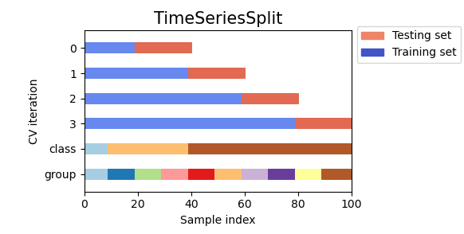
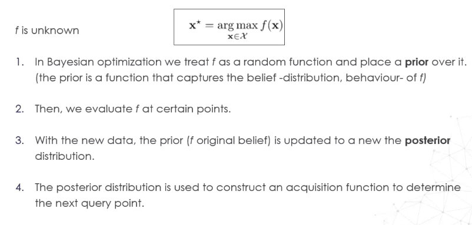
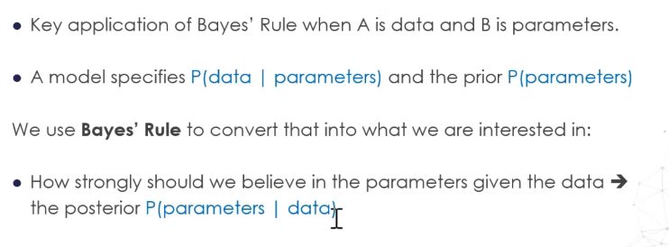
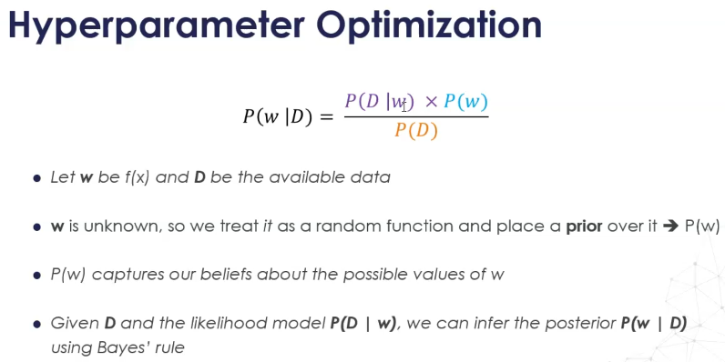
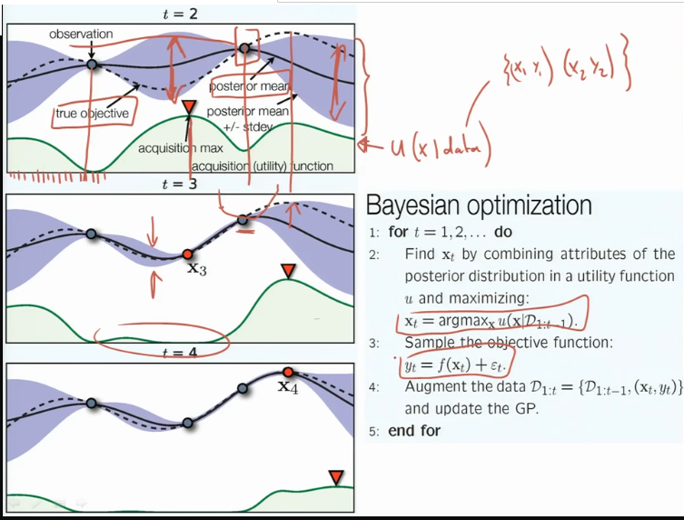

## Hyperparameter tuning

Hyperparameters are parameters that are not directly learnt by the model. They control the capacity of the model.

The parameters of the model are intrinsic t model equation and are optimized during training. Hyperparameters are defined before training and constrain the algorithm.

A search of a hyperparameter consists of:

- Hyperparameter space
- A method for sampling candidate hyperparameters
- A cross-validation scheme
- A performance metric to optimize

Low effective dimension: Some hyperparameters dimensions don't matter so much, they don't impact the cost that much.

## Performance metrics

Use `make_score` to use a custom scoring function in scikit-learn.

## Cross-validation schemes

- **K-fold cross-validation**: The higher the K, the bigger the training set for each one of the k models 
- **Leave-One-Out cross-validation**: Computationally expensive + Some metrics can't be estimated when we have one observation in the test fold
- **Leave-P-Out cross-validation**
- **Repeated K-Fold cross-validation**: Repeat a # of times (shuffle the data + K-fold CV)
- **Stratified K-fold cross-validation**: Same as K-fold, but with the real proportion of observations of each class - Useful with imbalanced data

Some data may not be independent or identically distributed (Grouped data from the same subject, time series, etc) and normal cross-validation cannot be applied and a scheme from the **grouped cross-validation** family should be used instead. 

- **Grouped K-fold cross-validation**
- **Leave-One-Group-Out cross-validation**
- **Leave-P-Out cross-validation**
- **Cross-validation for time-series**: Successive training sets are supersets of those that come before them (Image below from scikit-learn doc).

Some advanced schemes are:

- **Nested cross-validation**: We do two cross-validations, one to get the best model and one to get a better estimate of the generalization error. With every loop in the generalization error cross-val, one gets a new model and ends up then with many models at the end. The difficulty is to decide what to do with them!

Using many estimators in gridsearchcv: https://stackoverflow.com/a/53292354

## Basic search algorithms

### Manual search

It's mainly used to get familiar with hyperparameters and their effects on the model and to delimit grid search.

Cons: It doesn't scale and is not reproducible + time-consuming

### Grid Search

It examines all possible combinations of the specified hyperparameters. It works well for models with simple hyperparameter spaces and it can be parallelized.

Cons: The # of combinations grow exponentially + not practical for continuous hyperparameters

### Random search

Hyperparameter values are selected by independent draws from a uniform distribution of the hyperparameter space. The user determines how many combinations to examine.

It is highly efficient in high dimensional spaces and well-suited for continuous hyperparameters. It is not that efficient in low dimensional spaces compared to grid search.

## Bayesian optimization

### Sequential search

Grid search and random search generate all the candidate points up-front and evaluate them (in parallel).

Sequential search techniques pick a few hyperparameter settings, evaluate their quality and then decide where to go next. This process is not parallelizable.

Bayesian optimization is a sequential strategy for global optimization of black-box functions, it doesn't assume any functional form.

To **estimate the prior**, one can use many algorithms such as gaussian processes, tree-parzen estimator, random forest

To know where to sample next, one needs an **acquisition function**:

- Expected improvement (EI)
- Gaussian process upper confidence bound (UCB)

### Bayesian inference

Prior probability is the unconditional probability assigned to an event before any relevant information is taken into account.

The posterior probability of an event is the conditional probability that is assigned after taking into account the new evidence.

Prior and Posterior probability are mathematically related by Bayes Rule

When it comes to data and parameters, Bayes rule is applied as follows:

### Sequential model-based optimization

The posterior P(w|D) represents the updated belief of w after contemplating D. Given the posterior distribution P(w|D), we construct an acquisition function to determine the next query point to sample w.

